# Diagram Layout Demos

Automatic layout as a rendering capability across twelve reference scenarios: Graphviz handles clustered, radial, free-form, state, lineage, and DAG topology; D2 handles modern semantic diagram DSLs.

`catalog.json` records the use case, question, diagram family, complexity, and engine-oriented tags.

| Architecture | Knowledge | Incident | Data lineage |
|---|---|---|---|
| 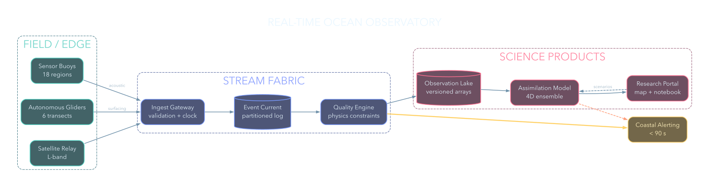 | 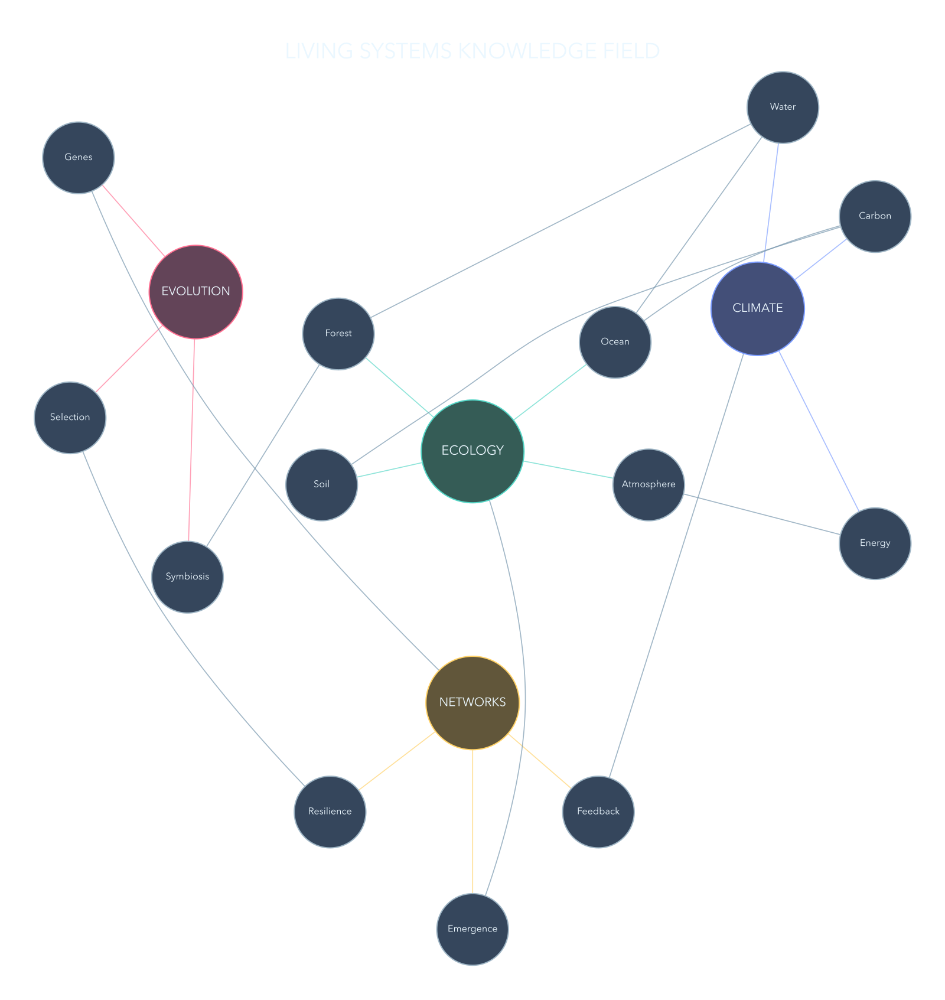 | 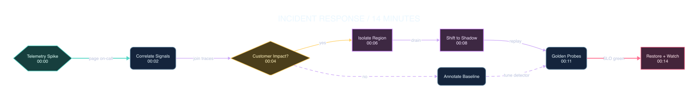 | 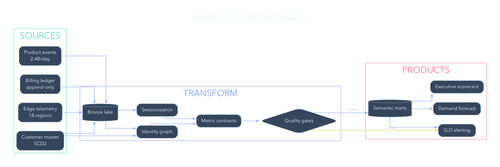 |
| State machine | Radial ontology | Build pipeline | Sequence |
| 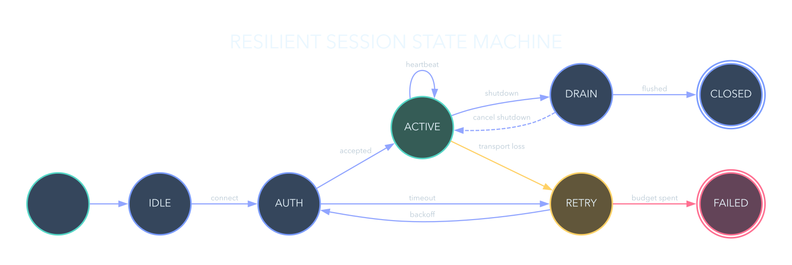 | 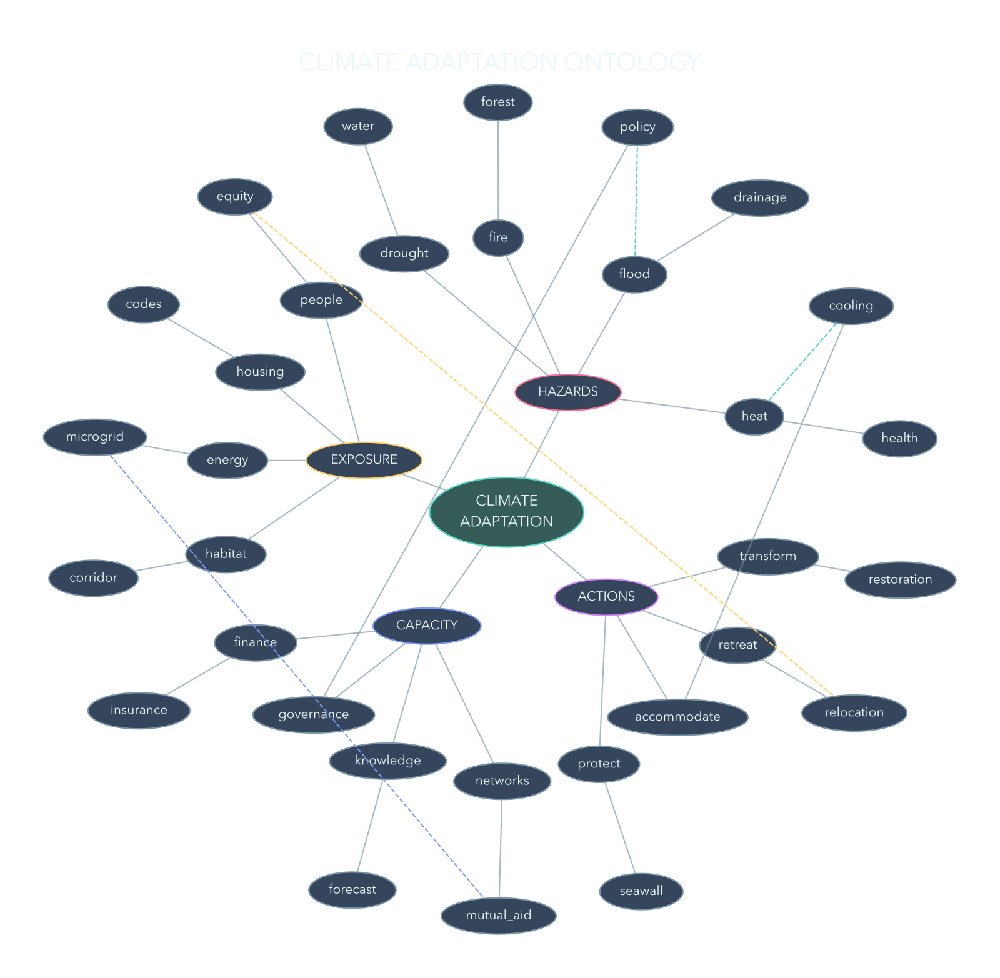 | 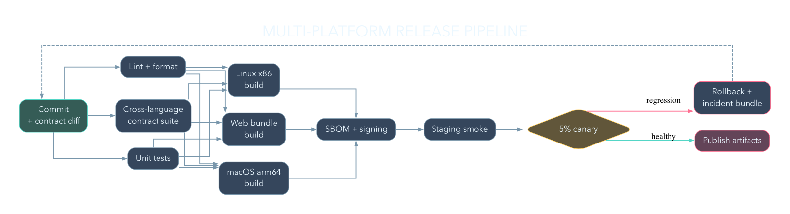 | 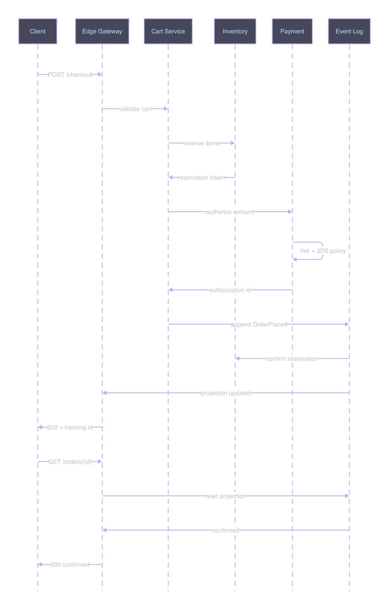 |
| Platform | Decision | Ownership | Event storm |
| 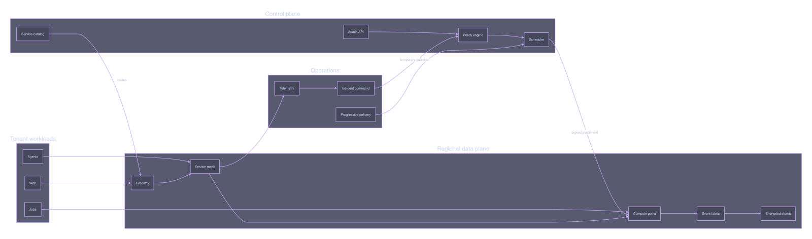 | 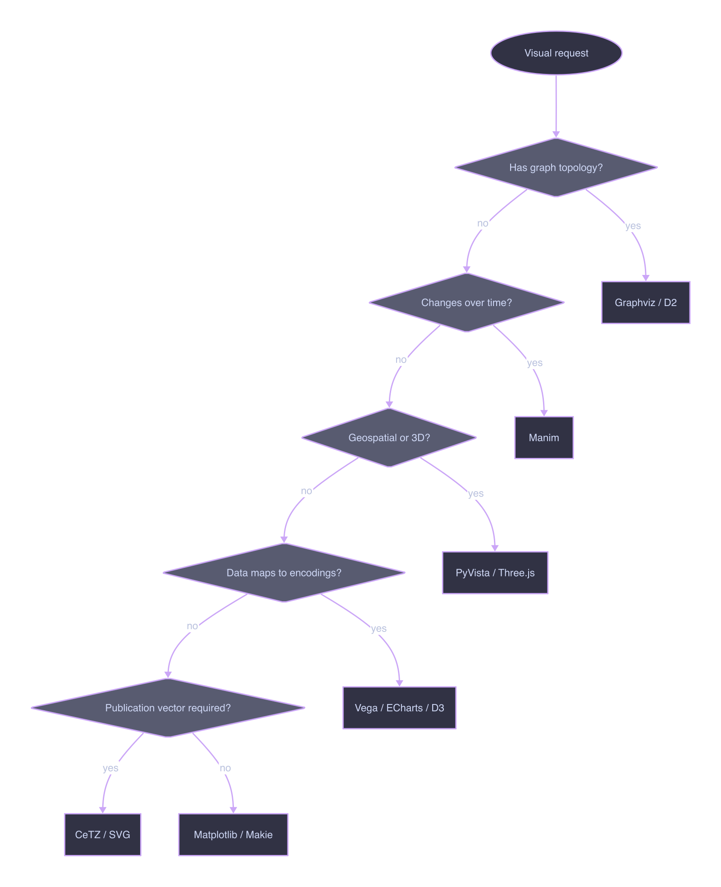 | 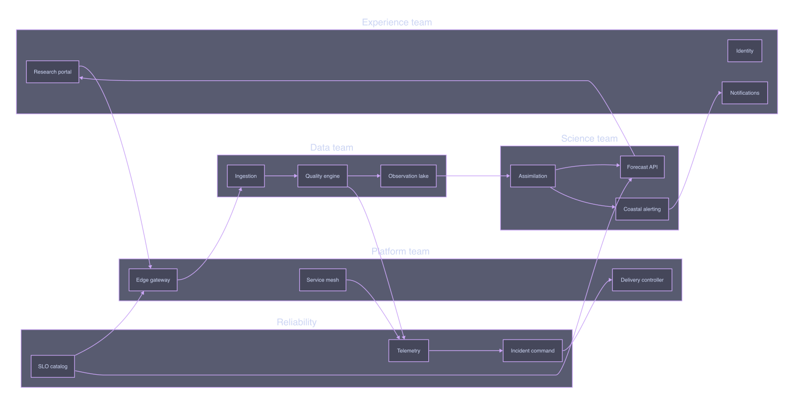 | 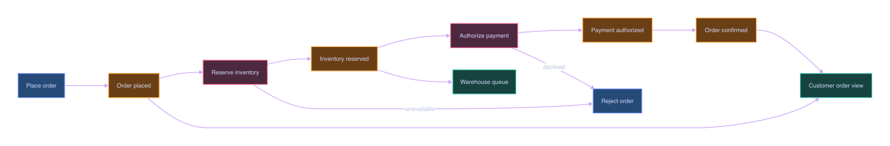 |

```bash
uv sync
uv run python tools/render.py
```

The renderer checks all external binaries, compiles DSL source to SVG, rasterizes with a transparent background, and rejects PNGs without meaningful alpha, content, and color.
